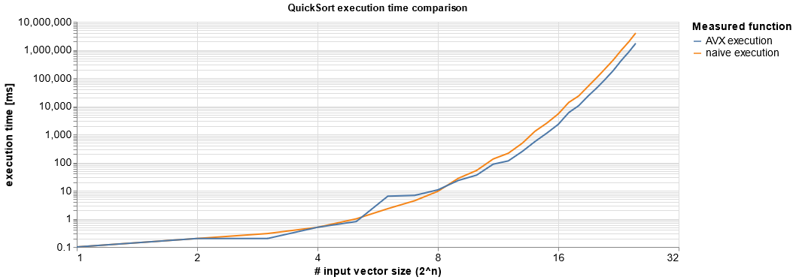

# QuickSortAVX

------------------------

**This QuickSort implementation is based on the blogpost by damageboy (Code in C#):**

https://bits.houmus.org/2020-01-28/this-goes-to-eleven-pt1

------------------------

**The implementation was made with AVX in-place in C++.**

With this implementation I am going to compare the naive Quicksort with the Quicksort in AVX in-place.

In the first part the naive Quicksort is going to sort the provided data.
The naive Quicksort is using a Threshold, where from that point the `InsertionSort` algorithm is going to be used.
After this part the data are sorted.

In the next more exciting part the Quicksort algorithm with AVX in-place is going to sort the data using `int` data type.
First, a helper array `_temp` of size `3 x N_OFFSET` is going to be created. `N_OFFSET` size is the amount of registers
that AVX can use simultaneously. Since I am using `AVX2` (= 256 bit) and `int` (= 32 bit), `N_OFFSET`is going to be `N_OFFSET = 256 / 32 = 8` bit.
The size of `N_OFFSET` is going to be multiply by 3, since I copy the array from each side 8 Interger values and the middle part is going to be
some free space.

Special cases, where the array size is going to be 0, 1, 2 or 3 are going to be considered. Here the code is also going to use a threshold
for sorting the smaller array with `InsertionSort`. With the method **median-of-three** the code defines the pivot element. The pivot element is
always going to be places at the end of the provided chunk array. This is just cause that we make sure that the pivot that we selected is not by
coincidence the biggest value of the array.
Quicksort has the condition that after one iteration there must be two whole value ranges. If the randomly chosen pivot is the largest number,
this would lead to an infinite loop, because the "smaller than"-range would correspond to the whole array.
Therefore, the `mid` entry (i.e. the selected pivot) is exchanged with the right element `right` to ensure **Divide and Conquer**, so that two whole value ranges are created.

**From here on the in-place partitioning with AVX2 is going to start:**

First the chosen pivot element is going to be broadcasted with the intrinsic `_mm256_broadcastd_epi32`, so that an array of size 8 and type `__m256i` with the same pivot element is going to be created.
In the partitioning code the very first 8 element are going to the read with the intrinsic `_mm256_lddqu_si256` and are going to be compared with the array of size 8 (`__m256i`) with the 
intrinsic `_mm256_cmpgt_epi32`. The output of the compared array is going to be an array `__m256i` with the values `0` (`0x00000000`) or `-1` (`0XFFFFFFF`), where as `-1`
means, that the values in the corresponding index are greater than the pivot element. A mask is going to be created with the compared data by using
the intrinsic `_mm256_movemask_ps`. This mask is used as index to get the corresponding permutation values from a pre-generated permutation table
(lookup table) to permute the data with the intrinsic `_mm256_permutevar8x32_epi32`. The permutation assign in each case with the `1` bit respectively
that are `greater than` the pivot element, where these are always on the right-hand side, and the `0` bit that are less than the pivot element and 
are on the left-hand side.

The output of this permutation are stored at the beginning and at the end of the helper array `_temp`. Thereby the intrinsic `_mm_popcnt_u32` is used
to count the number `1` in the mask to shift the pointers accordingly.

From here on the data are going to be sorted in-place of the same array (without using the helper array). It will alway start sort from the smaller part
of each side (`(readLeft - writeLeft) <= (writeRight - readRight)`). The remainder in the middle of the array is going to be treated separately together
with the helper array. At the end the values in the helper array are going to be copied back to the original array.

The pivot, which was previously copied at the right side of the array, is going to be placed (switched) back to is previouis position, which is then
going to be treated as the `boundary` for the **Divide and Conquer** approach.

After the whole procedure the Quicksort is going to be called recursively depending on the `boundary`.
The result after all these described steps is a sorted array with a noticeable speed up.

**Testresults:**

Here I am going to compare the naive Quicksort implementation with the in-place Quicksort algorithm with AVX.
The x-axis is the array size, while the y-axis is the duration time in ms which took to sort the array.

<!--  -->
 

